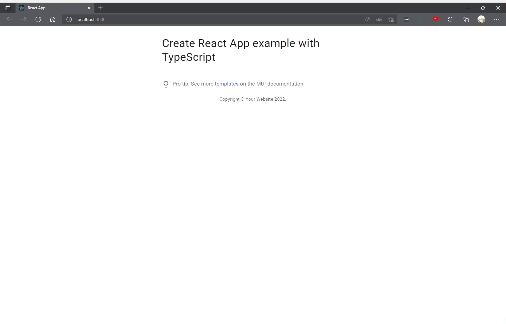

# React✕MUI Starter

ReactとMUIで開発したスターター。(MUIを理解するために開発した)

# インストール

```powershell
/> npx create-react-app --template typescript myapp
```

* `npm start`：開発サーバ始動
* `npm run build`：ビルドしてHTML/CSS/JSファイルを作成
* `npm test`：jestによるテストの実行

# MUIのインストール

```powershell
/> npm install @mui/material @emotion/react @emotion/styled

# svg形式のアイコンをインストールしたいならこちら
/> npm install @mui/icons-material
```

# プロジェクトの作成

まずはディレクトリを以下のようにする

`public`

```
favicon.ico
index.html
manifest.json
```

`src`

```
App.tsx
index.tsx
ProTip.tsx
react-app-env.d.ts
theme.ts
```

これらのコードをコピペする

`src/App.tsx`

```tsx
import * as React from 'react'
import Container from '@mui/material/Container'
import Typography from '@mui/material/Typography'
import Box from '@mui/material/Box'
import Link from '@mui/material/Link'
import ProTip from './ProTip'

function Copyright() {
  return (
    <Typography variant="body2" color="text.secondary" align="center">
      {'Copyright © '}
      <Link color="inherit" href="https://mui.com/">
        Your Website
      </Link>{' '}
      {new Date().getFullYear()}.
    </Typography>
  );
}

export default function App() {
  return (
    <Container maxWidth="sm">
      <Box sx={{ my: 4 }}>
        <Typography variant="h4" component="h1" gutterBottom>
          Create React App example with TypeScript
        </Typography>
        <ProTip />
        <Copyright />
      </Box>
    </Container>
  );
}
```

`src/index.tsx`

```tsx
import * as React from 'react';
import ReactDOM from 'react-dom';
import CssBaseline from '@mui/material/CssBaseline';
import { ThemeProvider } from '@mui/material/styles';
import App from './App';
import theme from './theme';


ReactDOM.render(
  <ThemeProvider theme={theme}>
    {/* CssBaseline kickstart an elegant, consistent, and simple baseline to build upon. */}
    <CssBaseline />
    <App />
  </ThemeProvider>,
  document.querySelector('#root'),
);
```

`src/ProTip.tsx`

```tsx
import * as React from 'react';
import Link from '@mui/material/Link';
import SvgIcon, { SvgIconProps } from '@mui/material/SvgIcon';
import Typography from '@mui/material/Typography';

function LightBulbIcon(props: SvgIconProps) {
    return (
        <SvgIcon {...props}>
            <path d="M9 21c0 .55.45 1 1 1h4c.55 0 1-.45 1-1v-1H9v1zm3-19C8.14 2 5 5.14 5 9c0 2.38 1.19 4.47 3 5.74V17c0 .55.45 1 1 1h6c.55 0 1-.45 1-1v-2.26c1.81-1.27 3-3.36 3-5.74 0-3.86-3.14-7-7-7zm2.85 11.1l-.85.6V16h-4v-2.3l-.85-.6C7.8 12.16 7 10.63 7 9c0-2.76 2.24-5 5-5s5 2.24 5 5c0 1.63-.8 3.16-2.15 4.1z" />
        </SvgIcon>
    );
}

export default function ProTip() {
    return (
        <Typography sx={{ mt: 6, mb: 3 }} color="text.secondary">
            <LightBulbIcon sx={{ mr: 1, verticalAlign: 'middle' }} />
            Pro tip: See more <Link href="https://mui.com/getting-started/templates/">templates</Link> on
            the MUI documentation.
        </Typography>
    );
}
```

`src/theme.tsx`

```tsx
import { createTheme } from '@mui/material/styles';
import { red } from '@mui/material/colors';

// A custom theme for this app
const theme = createTheme({
    palette: {
        primary: {
            main: '#556cd6',
        },
        secondary: {
            main: '#19857b',
        },
        error: {
            main: red.A400,
        },
    },
});

export default theme;
```

これらを準備しておいて起動すると、以下のような画面が表示される

